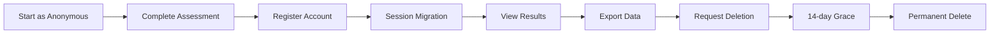

# 🧪 THOROUGH TESTING PLAN - PPSDM KMITS 72H Implementation

## 📋 Testing Overview

**Scope:** Complete coverage of all critical fixes
**Duration:** 8-12 hours
**Priority:** UU PDP Compliance > Anonymous Auth > Font Optimization > Assessment Engine

---

## 1️⃣ API ENDPOINT TESTING

### 1.1 UU PDP Compliance APIs

#### Test 1.1.1: Data Export API
```bash
# Happy Path - Authenticated User
curl -X GET http://localhost:3000/api/user/export \
  -H "Authorization: Bearer <valid_token>" \
  -H "Content-Type: application/json"

# Expected: 200 OK with PDF download
# Verify: PDF contains all assessment data, branding, timestamp

# Error Path - No Auth
curl -X GET http://localhost:3000/api/user/export

# Expected: 401 Unauthorized
```

#### Test 1.1.2: Soft Delete API
```bash
# Happy Path - Initiate Deletion
curl -X POST http://localhost:3000/api/user/delete \
  -H "Authorization: Bearer <valid_token>" \
  -H "Content-Type: application/json" \
  -d '{"reason": "User requested", "confirm": true}'

# Expected: 200 OK with deletion_scheduled_at timestamp
# Verify: User marked for deletion, 14-day grace period set

# Error Path - Already Scheduled
curl -X POST http://localhost:3000/api/user/delete \
  -H "Authorization: Bearer <valid_token>" \
  -H "Content-Type: application/json"

# Expected: 400 Already scheduled for deletion
```

#### Test 1.1.3: Cancel Deletion API
```bash
# Happy Path - Cancel within grace period
curl -X POST http://localhost:3000/api/user/delete/cancel \
  -H "Authorization: Bearer <valid_token>" \
  -H "Content-Type: application/json"

# Expected: 200 OK, deletion cancelled
# Verify: User can access account normally
```

### 1.2 Anonymous User APIs

#### Test 1.2.1: Assessment Submit (Anonymous)
```bash
# Happy Path - Anonymous Submission
curl -X POST http://localhost:3000/api/assessment/submit \
  -H "Content-Type: application/json" \
  -d '{
    "sessionId": "anon-session-123",
    "dimension": "cognitive",
    "questionId": "q1",
    "responseValue": 4,
    "sessionToken": "anon-token-xyz"
  }'

# Expected: 200 OK, response saved with null user_id
# Verify: Database has user_id = NULL, session_token set
```

#### Test 1.2.2: Session Migration (Anonymous → Logged In)
```bash
# After login, migrate anonymous session
curl -X POST http://localhost:3000/api/assessment/migrate-session \
  -H "Authorization: Bearer <new_token>" \
  -H "Content-Type: application/json" \
  -d '{"sessionToken": "anon-token-xyz"}'

# Expected: 200 OK, session migrated to user_id
```

### 1.3 Study Groups API

#### Test 1.3.1: CRUD Operations
```bash
# Create Study Group
curl -X POST http://localhost:3000/api/study-groups \
  -H "Authorization: Bearer <token>" \
  -H "Content-Type: application/json" \
  -d '{
    "name": "Test Study Group",
    "description": "For testing",
    "maxMembers": 10,
    "isPrivate": false
  }'

# Get Study Groups
curl -X GET http://localhost:3000/api/study-groups \
  -H "Authorization: Bearer <token>"

# Join Study Group
curl -X POST http://localhost:3000/api/study-groups/<id>/join \
  -H "Authorization: Bearer <token>"
```

---

## 2️⃣ DATABASE MIGRATION TESTING

### 2.1 Anonymous User Schema
```sql
-- Verify NOT NULL constraints removed
SELECT column_name, is_nullable 
FROM information_schema.columns 
WHERE table_name = 'assessment_sessions' 
AND column_name = 'user_id';

-- Expected: is_nullable = YES

-- Verify session_token column exists
SELECT column_name, data_type 
FROM information_schema.columns 
WHERE table_name = 'assessment_sessions' 
AND column_name = 'session_token';

-- Expected: data_type = character varying
```

### 2.2 UU PDP Compliance Schema
```sql
-- Verify deletion_scheduled_at column
SELECT column_name, data_type 
FROM information_schema.columns 
WHERE table_name = 'users' 
AND column_name = 'deletion_scheduled_at';

-- Verify audit_logs table exists
SELECT EXISTS (
  SELECT FROM information_schema.tables 
  WHERE table_name = 'deletion_audit_logs'
);

-- Expected: true
```

### 2.3 RLS Policies
```sql
-- Verify anonymous access policy
SELECT policyname, permissive, roles, cmd, qual 
FROM pg_policies 
WHERE tablename = 'assessment_sessions' 
AND policyname LIKE '%anonymous%';

-- Expected: Policy allowing NULL user_id with session_token
```

---

## 3️⃣ FRONTEND COMPONENT TESTING

### 3.1 DataManagementSection Component
```typescript
// Test cases to verify:
1. Export button triggers PDF download
2. Delete button shows confirmation modal
3. Grace period countdown displays correctly
4. Cancel deletion button works within 14 days
5. Error states handled (network error, auth error)
```

### 3.2 AssessmentRunner Component
```typescript
// Test cases to verify:
1. Renders all 9 dimensions correctly
2. Navigation (next/prev) works
3. Timer functions properly
4. Progress tracking accurate
5. Submission saves data
6. Anonymous mode works without login
```

### 3.3 StudyGroups Component
```typescript
// Test cases to verify:
1. List displays correctly
2. Create group form works
3. Join/Leave functionality
4. Loading states
5. Error handling
```

---

## 4️⃣ INTEGRATION FLOW TESTING

### 4.1 Complete User Journey: Anonymous → Registered → Export → Delete



**Test Steps:**
1. Start assessment as anonymous user
2. Complete 2-3 dimensions
3. Register new account
4. Verify session migration (data preserved)
5. Export all data as PDF
6. Request account deletion
7. Verify 14-day grace period email sent
8. Cancel deletion (should work)
9. Request deletion again
10. Wait for permanent deletion (or trigger manually)

### 4.2 Font Optimization Verification

**Visual Checks:**
1. Only 2 fonts loaded (Inter, Space Grotesk)
2. No FOUT (Flash of Unstyled Text)
3. Layout stable (no CLS)
4. Lighthouse performance score > 90

**Network Checks:**
```javascript
// In browser console, verify:
performance.getEntriesByType('resource')
  .filter(r => r.name.includes('font'))
  .map(r => r.name)

// Expected: Only 2 font files from next/font
```

---

## 5️⃣ PERFORMANCE TESTING

### 5.1 Lighthouse CI
```bash
npm run lighthouse
```

**Expected Scores:**
- Performance: > 90
- Accessibility: > 95
- Best Practices: > 90
- SEO: > 95

### 5.2 Bundle Analysis
```bash
npm run analyze
```

**Expected:**
- First Load JS: < 300KB
- Font payload: < 100KB (reduced from 3.2MB)

---

## 6️⃣ SECURITY TESTING

### 6.1 RLS Policy Verification
```sql
-- Test as anonymous user
SET LOCAL ROLE anon;
SELECT * FROM assessment_sessions WHERE user_id IS NULL;

-- Should return rows with session_token

-- Test as authenticated
SET LOCAL ROLE authenticated;
SELECT * FROM assessment_sessions WHERE user_id = '<user_id>';

-- Should only return user's own sessions
```

### 6.2 API Security
```bash
# Test without CSRF token (should fail)
curl -X POST http://localhost:3000/api/user/delete

# Test with invalid token (should fail)
curl -X POST http://localhost:3000/api/user/delete \
  -H "X-CSRF-Token: invalid"

# Test rate limiting (should throttle after N requests)
for i in {1..20}; do
  curl -X POST http://localhost:3000/api/assessment/submit
done
```

---

## 7️⃣ TESTING CHECKLIST

### ✅ Pre-Deployment
- [ ] All API endpoints return correct status codes
- [ ] Database migrations applied successfully
- [ ] RLS policies active and working
- [ ] Font optimization verified (2 fonts only)
- [ ] Anonymous user flow tested end-to-end
- [ ] UU PDP compliance features working
- [ ] Lighthouse scores meet targets
- [ ] No console errors
- [ ] No TypeScript errors
- [ ] Build successful

### ✅ Post-Deployment
- [ ] Smoke test on production
- [ ] Database connections stable
- [ ] Error monitoring (Sentry) receiving events
- [ ] Performance monitoring active
- [ ] User feedback collection ready

---

## 8️⃣ TESTING TOOLS

```bash
# Run all tests
npm run test:all

# Run specific test suites
npm run test:api        # API endpoint tests
npm run test:components # Component tests
npm run test:e2e        # Playwright E2E tests
npm run test:db         # Database tests
npm run test:security   # Security tests

# Run with coverage
npm run test:coverage
```

---

## 9️⃣ BUG TRACKING TEMPLATE

```markdown
### Bug Report: [Brief Description]

**Severity:** [Critical/High/Medium/Low]
**Component:** [API/Frontend/Database]
**Steps to Reproduce:**
1. 
2. 
3.

**Expected Result:**
**Actual Result:**
**Screenshots/Logs:**
**Environment:**
```

---

## 📊 SUCCESS METRICS

| Metric | Target | Actual | Status |
|--------|--------|--------|--------|
| API Response Time | < 200ms | | |
| Build Time | < 60s | | |
| Test Coverage | > 80% | | |
| Lighthouse Performance | > 90 | | |
| Font Requests | 2 | | |
| UU PDP Compliance | 100% | | |
| Anonymous Auth | Working | | |

---

**Testing Lead:** [Name]
**Start Date:** [Date]
**Completion Date:** [Date]
**Status:** 🟡 In Progress
