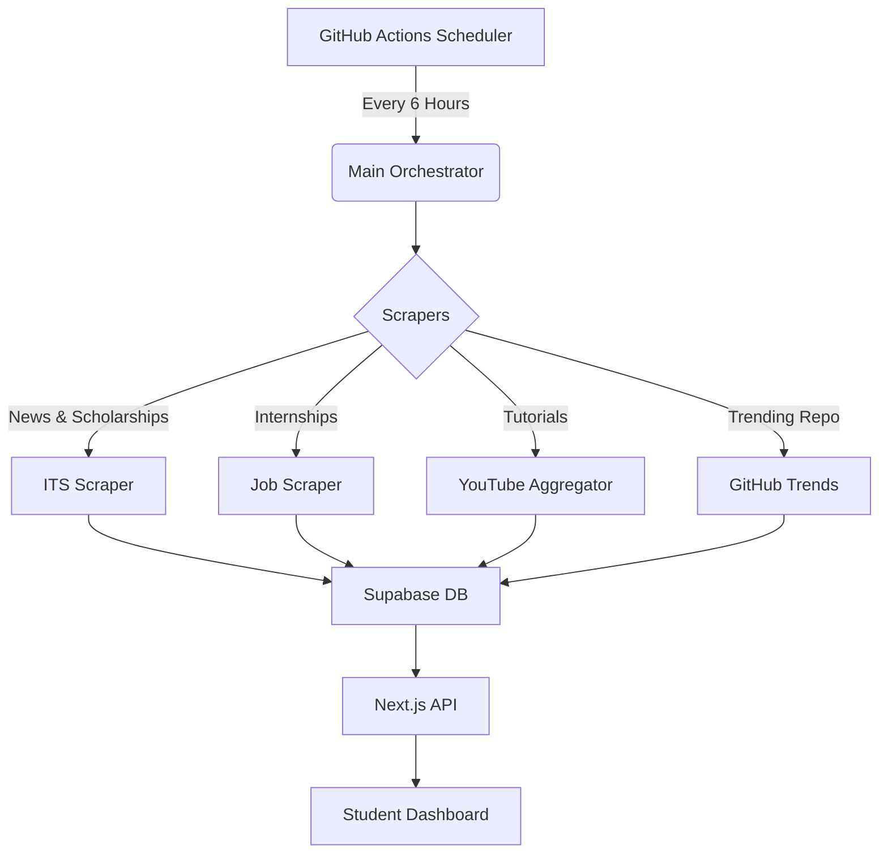

# SCRAPER SYSTEM ARCHITECTURE (v3.0)

## 📌 Overview
Subsystem otomatisasi untuk mengumpulkan data dari berbagai sumber eksternal (ITS Official, Job Portals, Social Media) guna mendukung konten PPSDM KMITS tanpa input manual.

## 🏗 Architecture
**Stack:** Python 3.10 + Supabase (PostgreSQL) + GitHub Actions
**Cost:** $0 (Free Tier Utilization)



## 📂 Components

### 1. ITS Scraper (`scripts/scrapers/its_scraper.py`)
- **Source**: `its.ac.id/news`, `beasiswa.co.id`
- **Data**: Campus News, Scholarship Info
- **Frequency**: Every 6 hours

### 2. Job Scraper (`scripts/scrapers/job_scraper.py`)
- **Source**: Kalibrr, Glints (Generic HTML parsing)
- **Data**: Internships, Part-time Jobs
- **Frequency**: Daily

### 3. YouTube Aggregator (`scripts/scrapers/youtube_aggregator.py`)
- **Source**: YouTube Data API (or RSS fallback)
- **Data**: Educational Videos (Programming, Soft Skills)
- **Channels**: Web Programming Unpas, Programmer Zaman Now, FreeCodeCamp
- **Output**: `scraped_videos` table

### 4. GitHub Trends (`scripts/scrapers/github_trending.py`)
- **Source**: GitHub API / Trending Page HTML
- **Data**: Trending Repositories in Python, TypeScript, Go
- **Output**: `scraped_repos` table

## 🗄 Database Schema
defined in `supabase/scraper_schema.sql`

```sql
CREATE TABLE scraped_news (...);
CREATE TABLE scraped_opportunities (...);
CREATE TABLE scraped_videos (
  id UUID PRIMARY KEY,
  title TEXT,
  url TEXT,
  thumbnail TEXT,
  channel TEXT,
  tags TEXT[],
  created_at TIMESTAMP
);
CREATE TABLE scraped_repos (
  id UUID PRIMARY KEY,
  name TEXT,
  url TEXT,
  stars INT,
  language TEXT,
  description TEXT,
  created_at TIMESTAMP
);
```

## 🚀 Deployment
1. **Repository**: Check database connection secrets in GitHub Repo.
2. **Workflow**: `.github/workflows/run_scrapers.yml`
3. **Execution**: Automatic via Cron or Manual Workflow Dispatch.

## 🛡 Ethical Rules
- **Rate Limit**: Min 2 seconds delay between requests.
- **User Agent**: Identifying as "PPSDM-KMITS-Bot/1.0".
- **Robots.txt**: Respecting disallowed paths.