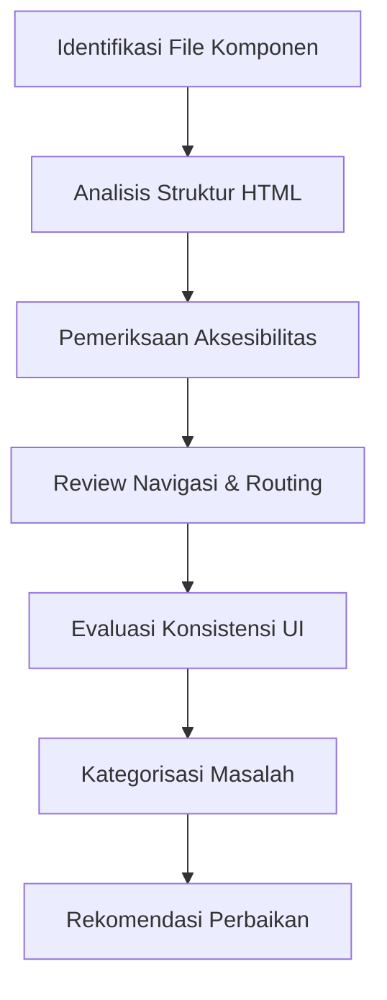
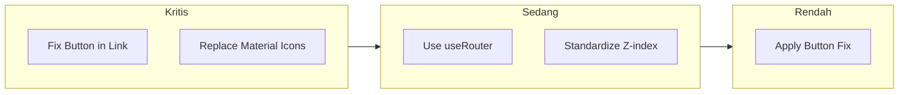

# Laporan Audit UI/UX Komprehensif

**Proyek:** PPSDM KMITS  
**Tanggal Audit:** 13 Februari 2026  
**Versi Dokumen:** 1.0  
**Status:** Selesai  

---

## Daftar Isi

1. [Ringkasan Eksekutif](#ringkasan-eksekutif)
2. [Metodologi Audit](#metodologi-audit)
3. [Temuan Audit](#temuan-audit)
   - [Masalah Kritis](#masalah-kritis)
   - [Masalah Sedang](#masalah-sedang)
   - [Masalah Rendah](#masalah-rendah)
4. [Rekomendasi Perbaikan](#rekomendasi-perbaikan)
5. [Checklist Validasi Perbaikan](#checklist-validasi-perbaikan)
6. [Prioritas Perbaikan](#prioritas-perbaikan)

---

## Ringkasan Eksekutif

Audit UI/UX telah dilakukan pada proyek PPSDM KMITS dan menemukan **7 masalah utama** yang terdiri dari:

| Prioritas | Jumlah | Persentase |
|-----------|--------|------------|
| 🔴 Kritis | 2 | 28.5% |
| 🟡 Sedang | 2 | 28.5% |
| 🟢 Rendah | 3 | 43% |

### Dampak Bisnis

1. **Aksesibilitas & SEO** - Masalah anti-pattern button di dalam link dapat mempengaruhi aksesibilitas dan SEO
2. **Performa** - Navigasi manual dengan `window.location.href` menyebabkan full page reload
3. **Konsistensi** - Penggunaan icon yang tidak konsisten dan z-index yang tidak terstandarisasi

### Rekomendasi Utama

- Perbaikan segera untuk masalah kritis terkait struktur HTML yang tidak valid
- Standarisasi sistem z-index untuk mencegah konflik di masa depan
- Migrasi ke navigasi Next.js yang optimal

---

## Metodologi Audit

Audit dilakukan dengan pendekatan berikut:



### Tools yang Digunakan
- Code review manual
- HTML validation guidelines
- Next.js best practices
- WCAG accessibility standards

---

## Temuan Audit

### Masalah Kritis

#### 🔴 MASALAH #1: Anti-pattern Button di dalam Link

**Prioritas:** Kritis  
**Kategori:** HTML Validation / Aksesibilitas  

##### Deskripsi
Struktur `<button>` di dalam `<a>` (Link) tidak valid secara HTML. Spesifikasi HTML melarang elemen interaktif bersarang di dalam elemen interaktif lainnya. Hal ini dapat menyebabkan:
- Perilaku yang tidak konsisten di berbagai browser
- Masalah aksesibilitas untuk pengguna screen reader
- Potensi masalah SEO

##### Lokasi File

| File | Baris Kode |
|------|------------|
| [`FloatingCTA.tsx`](../src/components/landing-page/FloatingCTA.tsx:39-45) | 39-45 |
| [`Navbar.tsx`](../src/components/landing-page/Navbar.tsx:94-111) | 94-111 |
| [`Navbar.tsx`](../src/components/landing-page/Navbar.tsx:171-176) | 171-176 |
| [`try-assessment/page.tsx`](../src/app/try-assessment/page.tsx:242-246) | 242-246 |

##### Kode Bermasalah

**FloatingCTA.tsx (Baris 39-45):**
```tsx
// ❌ SALAH: Button di dalam Link
<Link href="/try-assessment">
  <button className="bg-gradient-to-r from-blue-600 to-purple-600 text-white px-6 py-3 rounded-full shadow-lg hover:shadow-xl transition-all">
    Mulai Assessment
  </button>
</Link>
```

**Navbar.tsx (Baris 94-111):**
```tsx
// ❌ SALAH: Button di dalam Link
<Link href="/try-assessment">
  <button className="bg-blue-600 text-white px-4 py-2 rounded-lg hover:bg-blue-700">
    Coba Assessment
  </button>
</Link>
```

**Navbar.tsx (Baris 171-176):**
```tsx
// ❌ SALAH: Button di dalam Link
<Link href="/register">
  <button className="bg-green-600 text-white px-4 py-2 rounded-lg">
    Daftar Sekarang
  </button>
</Link>
```

**try-assessment/page.tsx (Baris 242-246):**
```tsx
// ❌ SALAH: Button di dalam Link
<Link href="/assessment">
  <button className="bg-primary text-white px-6 py-3 rounded-lg">
    Lanjutkan ke Assessment
  </button>
</Link>
```

##### Solusi

Hapus elemen `<button>` dan terapkan styling langsung ke `<Link>`:

```tsx
// ✅ BENAR: Styling langsung pada Link
<Link 
  href="/try-assessment"
  className="bg-gradient-to-r from-blue-600 to-purple-600 text-white px-6 py-3 rounded-full shadow-lg hover:shadow-xl transition-all inline-block"
>
  Mulai Assessment
</Link>
```

Atau gunakan komponen Button dengan prop `asChild` jika menggunakan library seperti Radix UI:

```tsx
// ✅ ALTERNATIF: Menggunakan Button dengan asChild
<Button asChild className="bg-gradient-to-r from-blue-600 to-purple-600">
  <Link href="/try-assessment">Mulai Assessment</Link>
</Button>
```

---

#### 🔴 MASALAH #2: Material Symbols Icon di HeroSection

**Prioritas:** Kritis  
**Kategori:** Konsistensi / Performa  

##### Deskripsi
Icon `arrow_forward` menggunakan class `material-symbols-outlined` yang bergantung pada font eksternal Google Material Symbols. Hal ini menyebabkan:
- Ketergantungan pada CDN eksternal
- Inkonsistensi dengan icon lain yang menggunakan Lucide
- Potensi flash of unstyled content (FOUC)
- Ukuran bundle yang tidak optimal

##### Lokasi File

| File | Baris Kode |
|------|------------|
| [`HeroSection.tsx`](../src/components/landing-page/HeroSection.tsx:117-118) | 117-118 |

##### Kode Bermasalah

**HeroSection.tsx (Baris 117-118):**
```tsx
// ❌ SALAH: Menggunakan Material Symbols
<span className="material-symbols-outlined">
  arrow_forward
</span>
```

##### Solusi

Ganti dengan Lucide icon (ArrowRight) untuk konsistensi:

```tsx
// ✅ BENAR: Menggunakan Lucide icon
import { ArrowRight } from 'lucide-react';

// Penggunaan
<ArrowRight className="w-5 h-5" />
```

**Contoh lengkap:**
```tsx
import { ArrowRight } from 'lucide-react';

export function HeroSection() {
  return (
    <div className="flex items-center gap-2">
      <span>Mulai Perjalanan</span>
      <ArrowRight className="w-5 h-5" />
    </div>
  );
}
```

---

### Masalah Sedang

#### 🟡 MASALAH #3: Navigasi Manual di CTASection

**Prioritas:** Sedang  
**Kategori:** Performa / User Experience  

##### Deskripsi
Penggunaan `window.location.href` untuk navigasi menyebabkan full page reload, yang menghilangkan keuntungan SPA (Single Page Application) dari Next.js. Hal ini mengakibatkan:
- Loading time yang lebih lambat
- Kehilangan state aplikasi
- Pengalaman pengguna yang tidak optimal

##### Lokasi File

| File | Baris Kode |
|------|------------|
| [`CTASection.tsx`](../src/components/landing-page/CTASection.tsx:25-40) | 25-40 |

##### Kode Bermasalah

**CTASection.tsx (Baris 25-40):**
```tsx
// ❌ SALAH: Navigasi manual dengan full page reload
const handleCTA = () => {
  window.location.href = '/try-assessment';
};

return (
  <button onClick={handleCTA} className="bg-primary text-white px-6 py-3">
    Mulai Assessment Gratis
  </button>
);
```

##### Solusi

Gunakan `useRouter` dari Next.js untuk client-side navigation:

```tsx
// ✅ BENAR: Menggunakan useRouter untuk SPA navigation
'use client';

import { useRouter } from 'next/navigation';

export function CTASection() {
  const router = useRouter();

  const handleCTA = () => {
    router.push('/try-assessment');
  };

  return (
    <button onClick={handleCTA} className="bg-primary text-white px-6 py-3">
      Mulai Assessment Gratis
    </button>
  );
}
```

**Atau lebih sederhana, gunakan Link langsung:**
```tsx
// ✅ PALING OPTIMAL: Langsung gunakan Link
import Link from 'next/link';

export function CTASection() {
  return (
    <Link 
      href="/try-assessment"
      className="bg-primary text-white px-6 py-3 inline-block"
    >
      Mulai Assessment Gratis
    </Link>
  );
}
```

---

#### 🟡 MASALAH #4: Z-index Conflict Potensial

**Prioritas:** Sedang  
**Kategori:** Konsistensi / Maintainability  

##### Deskripsi
Z-index yang sangat tinggi (100-101) berpotensi menyebabkan konflik dengan komponen lain dan sulit dikelola. Tanpa sistem z-index yang terstandarisasi, pengembang mungkin menggunakan nilai yang berbeda-beda dan menyebabkan stacking context yang tidak terduga.

##### Lokasi File

| File | Baris Kode |
|------|------------|
| [`ExitIntentPopup.tsx`](../src/components/landing-page/ExitIntentPopup.tsx:98) | 98 |
| [`ExitIntentPopup.tsx`](../src/components/landing-page/ExitIntentPopup.tsx:108) | 108 |

##### Kode Bermasalah

**ExitIntentPopup.tsx (Baris 98, 108):**
```tsx
// ❌ SALAH: Z-index hardcode dengan nilai tinggi
<div className="fixed inset-0 z-[100] bg-black/50">
  {/* Overlay */}
</div>

<div className="fixed z-[101] top-1/2 left-1/2 transform -translate-x-1/2 -translate-y-1/2">
  {/* Popup content */}
</div>
```

##### Solusi

Standarisasi sistem z-index menggunakan CSS variables atau Tailwind config:

**tailwind.config.js:**
```javascript
// ✅ BENAR: Sistem z-index terstandarisasi
module.exports = {
  theme: {
    extend: {
      zIndex: {
        'dropdown': '10',
        'sticky': '20',
        'fixed': '30',
        'modal-backdrop': '40',
        'modal': '50',
        'popover': '60',
        'tooltip': '70',
        'toast': '80',
      }
    }
  }
}
```

**CSS Variables (globals.css):**
```css
:root {
  --z-dropdown: 10;
  --z-sticky: 20;
  --z-fixed: 30;
  --z-modal-backdrop: 40;
  --z-modal: 50;
  --z-popover: 60;
  --z-tooltip: 70;
  --z-toast: 80;
}
```

**Implementasi:**
```tsx
// ✅ BENAR: Menggunakan z-index yang terstandarisasi
<div className="fixed inset-0 z-modal-backdrop bg-black/50">
  {/* Overlay */}
</div>

<div className="fixed z-modal top-1/2 left-1/2 transform -translate-x-1/2 -translate-y-1/2">
  {/* Popup content */}
</div>
```

---

### Masalah Rendah

#### 🟢 MASALAH #5-7: Link dengan Button (Duplikat Masalah #1)

**Prioritas:** Rendah  
**Kategori:** HTML Validation  

##### Deskripsi
Masalah yang sama dengan Masalah #1, ditemukan di lokasi tambahan. Meskipun prioritas rendah karena sifatnya duplikat, tetap perlu diperbaiki untuk konsistensi.

##### Lokasi Tambahan

Lihat detail di [Masalah #1](#masalah-1-anti-pattern-button-di-dalam-link)

##### Catatan
Perbaikan untuk Masalah #1 akan otomatis mencakup masalah ini jika dilakukan secara komprehensif.

---

## Rekomendasi Perbaikan

### Ringkasan Perbaikan per Prioritas



### Langkah Perbaikan Detail

#### 1. Perbaikan Anti-pattern Button di dalam Link

**File yang perlu diubah:**
- `src/components/landing-page/FloatingCTA.tsx`
- `src/components/landing-page/Navbar.tsx`
- `src/app/try-assessment/page.tsx`

**Template perbaikan:**
```tsx
// Sebelum
<Link href="/path">
  <button className="styles">Text</button>
</Link>

// Sesudah
<Link href="/path" className="styles inline-block">Text</Link>
```

**Catatan penting:**
- Tambahkan `inline-block` atau `flex` untuk memastikan Link mengikuti dimensi button
- Pertahankan semua styling yang ada

#### 2. Perbaikan Material Symbols Icon

**File yang perlu diubah:**
- `src/components/landing-page/HeroSection.tsx`

**Langkah:**
1. Import ArrowRight dari lucide-react
2. Ganti `<span className="material-symbols-outlined">arrow_forward</span>` dengan `<ArrowRight className="w-5 h-5" />`
3. Hapus link Google Fonts Material Symbols jika tidak digunakan di tempat lain

#### 3. Perbaikan Navigasi Manual

**File yang perlu diubah:**
- `src/components/landing-page/CTASection.tsx`

**Langkah:**
1. Import `useRouter` dari `next/navigation`
2. Ganti `window.location.href` dengan `router.push()`
3. Atau gunakan komponen `<Link>` langsung

#### 4. Standarisasi Z-index

**File yang perlu diubah:**
- `tailwind.config.js` atau `globals.css`
- `src/components/landing-page/ExitIntentPopup.tsx`

**Langkah:**
1. Definisikan sistem z-index di konfigurasi
2. Update komponen untuk menggunakan z-index yang terstandarisasi
3. Dokumentasikan penggunaan z-index untuk tim

---

## Checklist Validasi Perbaikan

Gunakan checklist berikut untuk memvalidasi bahwa semua perbaikan telah dilakukan dengan benar:

### Masalah #1: Button di dalam Link

- [ ] `FloatingCTA.tsx` - Button telah dihapus, styling dipindahkan ke Link
- [ ] `Navbar.tsx` (baris 94-111) - Button telah dihapus, styling dipindahkan ke Link
- [ ] `Navbar.tsx` (baris 171-176) - Button telah dihapus, styling dipindahkan ke Link
- [ ] `try-assessment/page.tsx` - Button telah dihapus, styling dipindahkan ke Link
- [ ] Validasi visual: Tampilan tetap sama setelah perubahan
- [ ] Validasi fungsional: Link dapat diklik dan navigasi berfungsi
- [ ] Validasi HTML: Tidak ada error di HTML validator

### Masalah #2: Material Symbols Icon

- [ ] `HeroSection.tsx` - Import ArrowRight dari lucide-react ditambahkan
- [ ] `HeroSection.tsx` - Material symbols diganti dengan ArrowRight
- [ ] Google Fonts Material Symbols dihapus dari layout jika tidak digunakan
- [ ] Validasi visual: Icon tampil dengan benar
- [ ] Validasi konsistensi: Semua icon menggunakan Lucide

### Masalah #3: Navigasi Manual

- [ ] `CTASection.tsx` - useRouter diimport dari next/navigation
- [ ] `CTASection.tsx` - window.location.href diganti dengan router.push()
- [ ] Validasi fungsional: Navigasi berfungsi tanpa full page reload
- [ ] Validasi performa: Tidak ada loading penuh saat navigasi

### Masalah #4: Z-index

- [ ] Sistem z-index didefinisikan di tailwind.config.js atau globals.css
- [ ] `ExitIntentPopup.tsx` - Z-index diupdate menggunakan sistem baru
- [ ] Dokumentasi z-index ditambahkan ke panduan development
- [ ] Validasi visual: Popup tampil di atas elemen lain dengan benar
- [ ] Validasi konflik: Tidak ada z-index conflict dengan komponen lain

### Validasi Umum

- [ ] Semua unit test passed
- [ ] Build production berhasil tanpa error
- [ ] Tidak ada console error di browser
- [ ] Lighthouse score tidak menurun
- [ ] Cross-browser testing passed (Chrome, Firefox, Safari)

---

## Prioritas Perbaikan

### Fase 1: Perbaikan Kritis (Segera)

| # | Masalah | File | Estimasi Impact |
|---|---------|------|-----------------|
| 1 | Button in Link | 4 files | High - Aksesibilitas & SEO |
| 2 | Material Symbols | 1 file | High - Konsistensi & Performa |

### Fase 2: Perbaikan Sedang (Penting)

| # | Masalah | File | Estimasi Impact |
|---|---------|------|-----------------|
| 3 | Navigasi Manual | 1 file | Medium - UX & Performa |
| 4 | Z-index | 2 files | Medium - Maintainability |

### Fase 3: Perbaikan Rendah (Opsional)

| # | Masalah | File | Estimasi Impact |
|---|---------|------|-----------------|
| 5-7 | Button in Link (duplikat) | Termasuk di #1 | Low - Sudah tercakup |

---

## Lampiran

### A. Referensi

- [HTML Standard - Content Model](https://html.spec.whatwg.org/multipage/dom.html#content-models)
- [Next.js Routing Documentation](https://nextjs.org/docs/app/building-your-application/routing)
- [WCAG 2.1 Guidelines](https://www.w3.org/WAI/WCAG21/quickref/)
- [Lucide Icons Documentation](https://lucide.dev/guide/)

### B. Riwayat Revisi

| Versi | Tanggal | Perubahan | Penulis |
|-------|---------|-----------|---------|
| 1.0 | 2026-02-13 | Dokumen awal | Audit Team |

---

*Dokumen ini dibuat sebagai bagian dari audit UI/UX komprehensif proyek PPSDM KMITS.*
