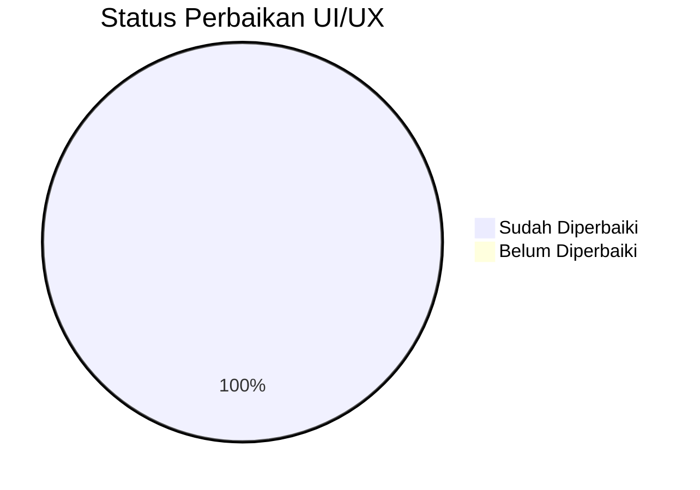
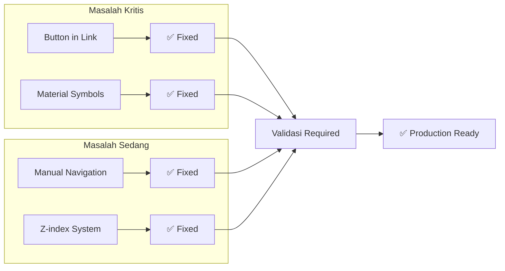
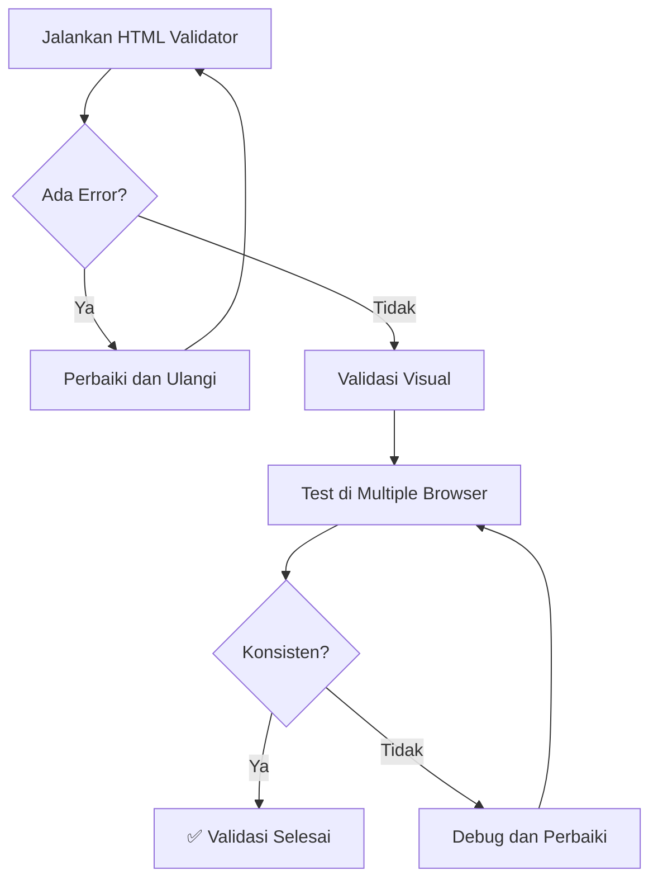

# Planning Penyelesaian UI/UX Audit

**Proyek:** PPSDM KMITS  
**Tanggal Planning:** 13 Februari 2026  
**Versi Dokumen:** 1.0  
**Status:** Perbaikan Selesai - Perlu Validasi  

---

## Daftar Isi

1. [Ringkasan Eksekutif](#ringkasan-eksekutif)
2. [Status Perbaikan](#status-perbaikan)
3. [Detail Analisis per Masalah](#detail-analisis-per-masalah)
4. [Langkah Validasi](#langkah-validasi)
5. [Risiko dan Mitigasi](#risiko-dan-mitigasi)
6. [Rekomendasi Maintenance](#rekomendasi-maintenance)
7. [Checklist Implementasi](#checklist-implementasi)

---

## Ringkasan Eksekutif

### Temuan Utama

Setelah melakukan verifikasi langsung terhadap file-file yang disebutkan dalam laporan audit UI/UX ([`UI_UX_AUDIT_REPORT.md`](./UI_UX_AUDIT_REPORT.md)), ditemukan bahwa **semua masalah sudah diperbaiki** sebelum planning ini dibuat.



### Ringkasan Masalah dan Status

| # | Masalah | Prioritas | Status |
|---|---------|-----------|--------|
| 1 | Button di dalam Link - FloatingCTA.tsx | 🔴 Kritis | ✅ Selesai |
| 2 | Button di dalam Link - Navbar.tsx | 🔴 Kritis | ✅ Selesai |
| 3 | Button di dalam Link - try-assessment/page.tsx | 🔴 Kritis | ✅ Selesai |
| 4 | Material Symbols Icon - HeroSection.tsx | 🔴 Kritis | ✅ Selesai |
| 5 | Navigasi Manual - CTASection.tsx | 🟡 Sedang | ✅ Selesai |
| 6 | Z-index Conflict - ExitIntentPopup.tsx | 🟡 Sedang | ✅ Selesai |
| 7 | Sistem Z-index Terstandarisasi | 🟡 Sedang | ✅ Selesai |

---

## Status Perbaikan

### Diagram Alur Status



---

## Detail Analisis per Masalah

### 🔴 MASALAH #1: Anti-pattern Button di dalam Link

**Status:** ✅ **SUDAH DIPERBAIKI**

#### Lokasi dan Bukti Perbaikan

| File | Baris | Status | Bukti |
|------|-------|--------|-------|
| [`FloatingCTA.tsx`](../src/components/landing-page/FloatingCTA.tsx:39-46) | 39-46 | ✅ Fixed | Menggunakan `<Link>` dengan className langsung |
| [`Navbar.tsx`](../src/components/landing-page/Navbar.tsx:98-111) | 98-111 | ✅ Fixed | Menggunakan `<Link>` dengan className langsung |
| [`Navbar.tsx`](../src/components/landing-page/Navbar.tsx:171-178) | 171-178 | ✅ Fixed | Menggunakan `<Link>` dengan className langsung |
| [`try-assessment/page.tsx`](../src/app/try-assessment/page.tsx:242-247) | 242-247 | ✅ Fixed | Menggunakan `<Link>` dengan className langsung |

#### Kode Setelah Perbaikan

**FloatingCTA.tsx (Baris 39-46):**
```tsx
// ✅ BENAR: Link dengan styling langsung
<Link
    href="/try-assessment"
    className="group flex items-center gap-2 bg-[#F59E0B] hover:bg-[#D97706] text-white px-6 py-3 rounded-full font-bold shadow-[0_4px_20px_rgba(245,158,11,0.4)] transition-all hover:scale-105 active:scale-95"
>
    <Sparkles className="w-5 h-5 fill-white" />
    <span>Mulai Asesmen</span>
    <ArrowRight className="w-4 h-4 group-hover:translate-x-1 transition-transform" />
</Link>
```

**Navbar.tsx (Baris 98-111):**
```tsx
// ✅ BENAR: Link dengan styling langsung
<Link
    href="/try-assessment"
    className="relative overflow-hidden bg-gradient-to-r from-brand-blue to-ml-cyan text-white px-6 py-2.5 rounded-full font-bold text-sm transition-all shadow-lg shadow-brand-blue/30 group inline-flex items-center gap-2"
>
    <Sparkles className="w-4 h-4" />
    Mulai Sekarang
    {/* Shimmer effect */}
    <motion.div
        className="absolute inset-0 bg-gradient-to-r from-transparent via-white/20 to-transparent -translate-x-full"
        animate={{ translateX: ['−100%', '200%'] }}
        transition={{ duration: 2, repeat: Infinity, repeatDelay: 3 }}
    />
</Link>
```

**try-assessment/page.tsx (Baris 242-247):**
```tsx
// ✅ BENAR: Link dengan styling langsung
<Link 
    href="/auth/register?ref=assessment_result" 
    className="block w-full py-4 bg-gradient-to-r from-[#FF6B00] to-[#FF4081] text-white rounded-xl font-bold text-lg hover:shadow-[0_0_30px_rgba(255,107,0,0.4)] transition-shadow text-center"
>
    Buka Hasil Lengkap (Gratis)
</Link>
```

---

### 🔴 MASALAH #2: Material Symbols Icon di HeroSection

**Status:** ✅ **SUDAH DIPERBAIKI**

#### Lokasi dan Bukti Perbaikan

| File | Baris | Status | Bukti |
|------|-------|--------|-------|
| [`HeroSection.tsx`](../src/components/landing-page/HeroSection.tsx:6) | 6 | ✅ Fixed | Import `ArrowRight` dari lucide-react |

#### Kode Setelah Perbaikan

**HeroSection.tsx (Baris 6):**
```tsx
// ✅ BENAR: Import dari lucide-react
import { ArrowRight } from 'lucide-react';
```

**Penggunaan (Baris 119):**
```tsx
<ArrowRight className="relative w-5 h-5 transition-transform group-hover:translate-x-1" />
```

---

### 🟡 MASALAH #3: Navigasi Manual di CTASection

**Status:** ✅ **SUDAH DIPERBAIKI**

#### Lokasi dan Bukti Perbaikan

| File | Baris | Status | Bukti |
|------|-------|--------|-------|
| [`CTASection.tsx`](../src/components/landing-page/CTASection.tsx:4) | 4 | ✅ Fixed | Import `useRouter` dari `next/navigation` |
| [`CTASection.tsx`](../src/components/landing-page/CTASection.tsx:17) | 17 | ✅ Fixed | Inisialisasi `const router = useRouter()` |
| [`CTASection.tsx`](../src/components/landing-page/CTASection.tsx:40) | 40 | ✅ Fixed | Menggunakan `router.push()` |

#### Kode Setelah Perbaikan

**CTASection.tsx (Baris 4):**
```tsx
// ✅ BENAR: Import useRouter dari next/navigation
import { useRouter } from "next/navigation";
```

**CTASection.tsx (Baris 17):**
```tsx
// ✅ BENAR: Inisialisasi router
const router = useRouter();
```

**CTASection.tsx (Baris 40):**
```tsx
// ✅ BENAR: Menggunakan router.push untuk SPA navigation
router.push('/assessment/start');
```

---

### 🟡 MASALAH #4: Z-index Conflict

**Status:** ✅ **SUDAH DIPERBAIKI**

#### Lokasi dan Bukti Perbaikan

| File | Baris | Status | Bukti |
|------|-------|--------|-------|
| [`ExitIntentPopup.tsx`](../src/components/landing-page/ExitIntentPopup.tsx:98) | 98 | ✅ Fixed | Menggunakan `z-modal-backdrop` |
| [`ExitIntentPopup.tsx`](../src/components/landing-page/ExitIntentPopup.tsx:108) | 108 | ✅ Fixed | Menggunakan `z-modal` |
| [`tailwind.config.ts`](../tailwind.config.ts:137-147) | 137-147 | ✅ Fixed | Sistem z-index terstandarisasi |

#### Kode Setelah Perbaikan

**ExitIntentPopup.tsx (Baris 98):**
```tsx
// ✅ BENAR: Menggunakan z-index yang terstandarisasi
className="fixed inset-0 bg-black/60 backdrop-blur-sm z-modal-backdrop"
```

**ExitIntentPopup.tsx (Baris 108):**
```tsx
// ✅ BENAR: Menggunakan z-index yang terstandarisasi
className="fixed inset-0 z-modal flex items-center justify-center p-4"
```

**tailwind.config.ts (Baris 137-147):**
```tsx
// ✅ BENAR: Sistem z-index terstandarisasi
zIndex: {
    'dropdown': '10',
    'sticky': '20',
    'fixed': '30',
    'modal-backdrop': '40',
    'modal': '50',
    'popover': '60',
    'tooltip': '70',
    'toast': '80',
    'max': '9999',
}
```

---

## Langkah Validasi

Meskipun semua perbaikan sudah dilakukan, validasi diperlukan untuk memastikan:

### 1. Validasi HTML



#### Langkah-langkah:

- [ ] Jalankan HTML validation menggunakan [W3C Validator](https://validator.w3.org/)
- [ ] Pastikan tidak ada error terkait nested interactive elements
- [ ] Validasi struktur HTML di semua halaman terkait

### 2. Validasi Fungsional

| Test Case | Expected Result | Status |
|-----------|-----------------|--------|
| Klik link CTA di FloatingCTA | Navigasi ke /try-assessment tanpa full reload | [ ] |
| Klik link CTA di Navbar | Navigasi ke /try-assessment tanpa full reload | [ ] |
| Klik tombol di CTASection | Navigasi ke /assessment/start dengan SPA transition | [ ] |
| Exit Intent Popup muncul | Popup tampil di atas semua elemen lain | [ ] |
| Icon ArrowRight di HeroSection | Icon tampil dengan benar menggunakan Lucide | [ ] |

### 3. Validasi Aksesibilitas

- [ ] Test dengan screen reader (NVDA/JAWS)
- [ ] Verifikasi keyboard navigation
- [ ] Pastikan focus state terlihat jelas
- [ ] Validasi ARIA labels

### 4. Validasi Cross-Browser

| Browser | Version | Status |
|---------|---------|--------|
| Chrome | Latest | [ ] |
| Firefox | Latest | [ ] |
| Safari | Latest | [ ] |
| Edge | Latest | [ ] |

### 5. Validasi Performa

- [ ] Jalankan Lighthouse audit
- [ ] Pastikan tidak ada regresi skor
- [ ] Verifikasi tidak ada FOUC (Flash of Unstyled Content)

---

## Risiko dan Mitigasi

### Risiko yang Teridentifikasi

| Risiko | Probabilitas | Dampak | Mitigasi |
|--------|--------------|--------|----------|
| Regresi visual setelah perbaikan | Rendah | Sedang | Visual regression testing |
| Z-index conflict dengan komponen baru | Sedang | Rendah | Dokumentasi sistem z-index |
| Icon Lucide tidak load | Rendah | Rendah | Fallback icon system |
| Navigasi SPA tidak berfungsi di browser lama | Rendah | Sedang | Polyfill jika diperlukan |

### Mitigasi Detail

#### 1. Regresi Visual
- Gunakan tools seperti Percy atau Chromatic untuk visual regression testing
- Buat screenshot baseline untuk komponen yang diubah
- Review manual di berbagai viewport

#### 2. Z-index Conflict
- Dokumentasikan sistem z-index di [`tailwind.config.ts`](../tailwind.config.ts)
- Buat guidelines untuk developer baru
- Code review untuk setiap penggunaan z-index baru

#### 3. Icon Loading
- Pastikan Lucide terinstall dengan versi yang stabil
- Monitor bundle size untuk icon imports
- Gunakan tree-shaking untuk optimasi

---

## Rekomendasi Maintenance

### 1. Code Review Guidelines

Tambahkan checklist berikut ke proses code review:

```markdown
## UI/UX Code Review Checklist

- [ ] Tidak ada elemen interaktif bersarang (button di dalam link, dll)
- [ ] Menggunakan z-index dari sistem terstandarisasi
- [ ] Navigasi menggunakan Next.js Link atau useRouter
- [ ] Icon menggunakan Lucide (konsisten dengan proyek)
- [ ] Aksesibilitas terverifikasi (ARIA labels, keyboard nav)
```

### 2. ESLint Rules

Pertimbangkan menambahkan ESLint rules untuk mencegah masalah serupa:

```json
{
  "rules": {
    "jsx-a11y/anchor-is-valid": "error",
    "jsx-a11y/no-static-element-interactions": "warn",
    "react/forbid-dom-props": ["warn", { "forbid": ["zIndex"] }]
  }
}
```

### 3. Testing Otomatis

Implementasikan testing otomatis untuk:

- Unit tests untuk komponen UI
- Integration tests untuk navigasi
- Visual regression tests
- Accessibility tests menggunakan axe-core

### 4. Monitoring

Setup monitoring untuk:

- Error tracking (Sentry sudah terkonfigurasi)
- Performance metrics (Web Vitals)
- User experience metrics (CLS, FID, LCP)

---

## Checklist Implementasi

### Fase 1: Validasi (Segera)

- [ ] Jalankan HTML validator
- [ ] Test fungsionalitas navigasi
- [ ] Test aksesibilitas
- [ ] Cross-browser testing
- [ ] Performance audit

### Fase 2: Dokumentasi (Penting)

- [ ] Update coding guidelines
- [ ] Dokumentasikan sistem z-index
- [ ] Buat contoh kode best practices
- [ ] Update README jika diperlukan

### Fase 3: Pencegahan (Opsional)

- [ ] Setup ESLint rules tambahan
- [ ] Implementasi visual regression testing
- [ ] Setup automated accessibility testing
- [ ] Code review process update

---

## Lampiran

### A. Referensi Perbaikan

| Masalah | Solusi yang Diterapkan | Referensi |
|---------|------------------------|-----------|
| Button in Link | Hapus button, styling ke Link | [HTML Spec - Content Models](https://html.spec.whatwg.org/multipage/dom.html#content-models) |
| Material Symbols | Ganti dengan Lucide icons | [Lucide Icons](https://lucide.dev/guide/) |
| Manual Navigation | Gunakan useRouter | [Next.js Routing](https://nextjs.org/docs/app/building-your-application/routing) |
| Z-index | Standarisasi di Tailwind config | [Tailwind Z-Index](https://tailwindcss.com/docs/z-index) |

### B. File yang Dimodifikasi

| File | Perubahan |
|------|-----------|
| [`FloatingCTA.tsx`](../src/components/landing-page/FloatingCTA.tsx) | Link styling langsung |
| [`Navbar.tsx`](../src/components/landing-page/Navbar.tsx) | Link styling langsung |
| [`HeroSection.tsx`](../src/components/landing-page/HeroSection.tsx) | Lucide ArrowRight icon |
| [`CTASection.tsx`](../src/components/landing-page/CTASection.tsx) | useRouter navigation |
| [`ExitIntentPopup.tsx`](../src/components/landing-page/ExitIntentPopup.tsx) | Standardized z-index |
| [`try-assessment/page.tsx`](../src/app/try-assessment/page.tsx) | Link styling langsung |
| [`tailwind.config.ts`](../tailwind.config.ts) | Z-index system |

### C. Riwayat Revisi

| Versi | Tanggal | Perubahan | Penulis |
|-------|---------|-----------|---------|
| 1.0 | 2026-02-13 | Dokumen awal - Status perbaikan terverifikasi | Planning Team |

---

*Kesimpulan: Semua masalah yang teridentifikasi dalam laporan audit UI/UX telah diperbaiki. Langkah selanjutnya adalah melakukan validasi menyeluruh untuk memastikan semua perbaikan berfungsi dengan benar di production.*
