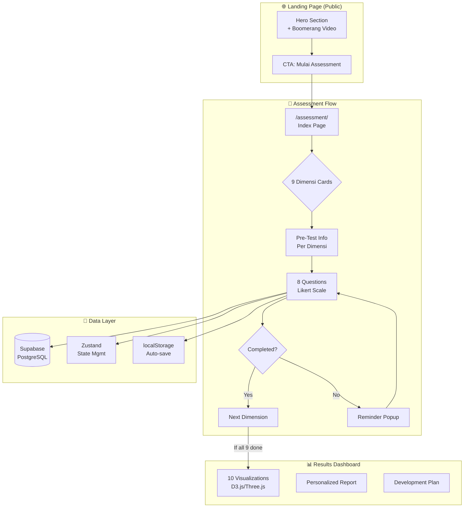
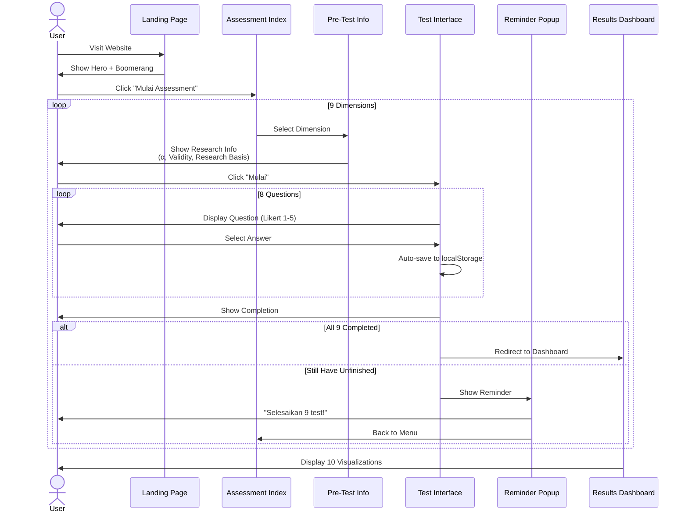

# 🧠 PPSDM KMITS Assessment System - Architecture V2

## Executive Summary

Sistem assessment 9 dimensi berdasarkan validasi psikometrik rigor dengan:
- **9 Dimensi** dengan total **72 pertanyaan** (8 per dimensi)
- **Reliabilitas tinggi**: α = 0.83-0.87 untuk semua dimensi
- **10 Diagram visualisasi** hasil yang interaktif
- **Akses publik** dengan arsitektur modular

---

## 🏗️ System Architecture



---

## 📋 9 Dimensions Overview

| # | Dimension | Items | Reliability | Validated Instruments |
|---|-----------|-------|-------------|----------------------|
| 1 | **Kognitif** | 8 | α=0.87 | CTDS, GMS, CSES, MAI |
| 2 | **Manajemen Diri** | 8 | α=0.87 | TMBS, TPS, BSCS |
| 3 | **Finansial** | 8 | α=0.85 | OECD/INFE, FMBS |
| 4 | **Kesehatan Fisik** | 8 | α=0.84 | IPAQ, PSQI, SVS |
| 5 | **Emosional** | 8 | α=0.84 | TEIQue-SF, IRI, SSI |
| 6 | **Kesehatan Mental** | 8 | α=0.86 | MHC-SF, CD-RISC, PSS-4 |
| 7 | **Karakter & Etika** | 8 | α=0.84 | VIA-IS, MFQ, Integrity Scale |
| 8 | **Spiritual** | 8 | α=0.85 | PIL, GQ-6, SWBS |
| 9 | **Lingkungan & Lifestyle** | 8 | α=0.83 | NEP, SLS, WLBS |

**Total**: 72 pertanyaan | **Estimasi waktu**: 25-30 menit

---

## 🎨 UI/UX Design System

### Color Palette
```
Primary Blue:    #135bec (ITS Blue)
Accent Cyan:     #00d4ff
Dark Background: #0A0F1A
Card Glass:      rgba(255,255,255,0.05)
Gold Accent:     #FFD700
Success:         #10B981
Warning:         #F59E0B
Danger:          #EF4444
```

### Dimension Colors
```
Kognitif:       #3498db (Blue)
Manajemen Diri: #2ecc71 (Green)
Finansial:      #e74c3c (Red)
Kesehatan Fisik:#1abc9c (Turquoise)
Emosional:      #9b59b6 (Purple)
Kesehatan Mental:#34495e (Dark Blue)
Karakter:       #f1c40f (Gold)
Spiritual:      #e67e22 (Orange)
Lingkungan:     #27ae60 (Forest Green)
```

---

## 🔄 Assessment Flow



---

## 📊 10 Visualization Diagrams

| # | Diagram Name | Library | Description |
|---|--------------|---------|-------------|
| 1 | **Holistic Development Radar Chart** | D3.js | 9-axis radar dengan current vs previous data |
| 2 | **Cognitive Sunburst** | D3.js | Hierarchical view cognitive skills |
| 3 | **Self-Management Gauge & Timeline** | D3.js + Chart.js | Productivity metrics over time |
| 4 | **Financial Waterfall & Network** | D3.js | Cash flow + knowledge network |
| 5 | **Emotional Circumplex** | D3.js | Plutchik emotion wheel |
| 6 | **Mental Health Ecosystem** | Three.js | Organic 3D ecosystem metaphor |
| 7 | **Character Compass** | D3.js | 8 cardinal virtues navigation |
| 8 | **Spiritual Mandala** | Three.js | Sacred geometry visualization |
| 9 | **Environmental Eco-Map** | D3.js | Carbon footprint + sustainability |
| 10 | **Integrated Ecosystem** | Three.js | 9 planets orbiting sun metaphor |

---

## 🛡️ Security & Privacy

### Crisis Protocol (Dimensi 6 - Mental Health)
```
IF (composite_score < 35) OR (risk_flags.length > 0):
  - Auto-show crisis resources
  - Provide emergency contacts
  - Suggest professional help
  - Log for follow-up (optional with consent)
```

### Data Protection
- Encryption: AES-256 untuk hasil sensitif
- Anonymization: UUID-based user identification
- Consent: Informed consent sebelum assessment
- PDP Compliance: Sesuai regulasi Indonesia

---

## 📁 File Structure

```
app/
├── (landing)/
│   ├── page.tsx                    # Landing dengan Boomerang
│   └── layout.tsx
├── assessment/
│   ├── page.tsx                    # Index 9 Dimensi
│   ├── layout.tsx
│   └── [dimensionId]/
│       ├── info/
│       │   └── page.tsx            # Pre-test Info
│       └── test/
│           └── page.tsx            # 8 Questions
├── results/
│   └── page.tsx                    # 10 Visualizations
│
components/
├── hero/
│   └── HeroBoomerang.tsx           # Canvas-based boomerang
├── assessment/
│   ├── DimensionCard.tsx           # Kartu dimensi (index)
│   ├── DimensionInfo.tsx           # Pre-test info page
│   ├── QuestionCard.tsx            # Pertanyaan interface
│   ├── ProgressBar.tsx             # Progress indicator
│   └── ReminderPopup.tsx           # Incomplete reminder
├── visualizations/
│   ├── RadarChart.tsx              # Diagram 1
│   ├── SunburstChart.tsx           # Diagram 2
│   ├── GaugeTimeline.tsx           # Diagram 3
│   ├── WaterfallNetwork.tsx        # Diagram 4
│   ├── Circumplex.tsx              # Diagram 5
│   ├── MentalEcosystem3D.tsx       # Diagram 6
│   ├── CharacterCompass.tsx        # Diagram 7
│   ├── SpiritualMandala3D.tsx      # Diagram 8
│   ├── EnvironmentalEco.tsx        # Diagram 9
│   └── IntegratedEcosystem3D.tsx   # Diagram 10
│
lib/
├── assessment/
│   ├── dimensions.ts               # Data 9 dimensi
│   ├── questions.ts                # 72 pertanyaan
│   ├── scoring.ts                  # Algoritma scoring
│   └── interpretations.ts          # Interpretasi hasil
├── db/
│   └── schema.ts                   # Database schema
│
public/
├── assets/
│   ├── boomerang/                  # 80 frames boomerang
│   └── images/                     # Generated illustrations
```

---

## 🚀 Implementation Phases

### Phase 1: Core (Week 1)
- [ ] Database setup
- [ ] Hero boomerang
- [ ] Assessment index page

### Phase 2: Assessment Flow (Week 2)
- [ ] 9 Pre-test info pages
- [ ] Question interface
- [ ] Auto-save system

### Phase 3: Results (Week 3)
- [ ] 10 Diagram visualizations
- [ ] Scoring algorithms
- [ ] Personalized feedback

### Phase 4: Polish (Week 4)
- [ ] Animations
- [ ] Mobile responsive
- [ ] Security enhancements

---

*Generated based on comprehensive psychometric validation research for Indonesian university students.*
