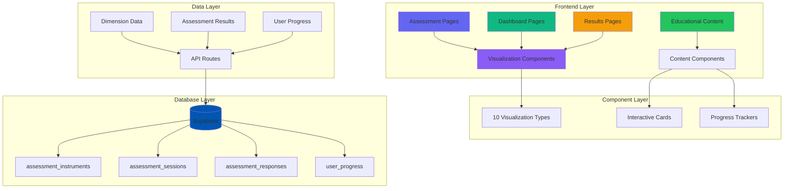

# 🎯 PPSDM KMM - ASSESSMENT SYSTEM INTEGRATION PLAN
## Integrasi Konten 9 Dimensi & 10 Diagram Visualisasi Holistik

---

## 📋 EXECUTIVE SUMMARY

Dokumen ini merencanakan integrasi lengkap konten riset assessment 9 dimensi dari `ASSESSMENT BROU` ke dalam website PPSDM KMM. Fokus utama adalah menciptakan pengalaman edukatif yang menarik, tidak membosankan, dan dapat diakses oleh semua pengguna.

---

## 🎨 UI/UX DESIGN PHILOSOPHY

### Prinsip Desain Utama

```
┌─────────────────────────────────────────────────────────────────┐
│                    EDUCATIONAL UX PRINCIPLES                    │
├─────────────────────────────────────────────────────────────────┤
│ 1. VISUAL HIERARCHY                                          │
│    - Informasi penting di atas (F-pattern)                    │
│    - Warna dan ukuran untuk menarik perhatian                │
│    - Konsistensi visual di seluruh platform                    │
│                                                              │
│ 2. PROGRESSIVE DISCLOSURE                                     │
│    - Mulai dengan overview sederhana                           │
│    - Tambah detail saat user membutuhkan                       │
│    - "Learn More" pattern untuk konten mendalam                  │
│                                                              │
│ 3. INTERACTIVE ENGAGEMENT                                     │
│    - Animasi halus untuk feedback                              │
│    - Hover states untuk eksplorasi                             │
│    - Micro-interactions untuk kepuasan user                      │
│                                                              │
│ 4. ACCESSIBILITY FIRST                                        │
│    - WCAG 2.1 AA compliance                                  │
│    - Keyboard navigation                                        │
│    - Screen reader friendly                                     │
│    - High contrast mode                                         │
│                                                              │
│ 5. MOBILE-FIRST RESPONSIVE                                    │
│    - Optimized untuk mobile (60% traffic)                       │
│    - Touch-friendly interactions                                │
│    - Progressive enhancement                                    │
└─────────────────────────────────────────────────────────────────┘
```

### Color Palette System

```css
/* Primary Colors - ITS Brand */
--its-blue: #0056b3;
--accent-blue: #0077b6;
--its-gold: #f4a261;

/* Dimension Colors */
--cognitive: #6366f1;      /* Indigo */
--self-management: #10b981;   /* Emerald */
--financial: #f59e0b;         /* Amber */
--physical: #ef4444;          /* Red */
--emotional: #8b5cf6;        /* Violet */
--mental: #06b6d4;           /* Cyan */
--character: #fbbf24;         /* Yellow */
--spiritual: #a855f7;         /* Purple */
--environmental: #22c55e;     /* Green */

/* Semantic Colors */
--success: #22c55e;
--warning: #f59e0b;
--danger: #ef4444;
--info: #3b82f6;

/* Neutral Colors */
--slate-50: #f8fafc;
--slate-100: #f1f5f9;
--slate-200: #e2e8f0;
--slate-300: #cbd5e1;
--slate-400: #94a3b8;
--slate-500: #64748b;
--slate-600: #475569;
--slate-700: #334155;
--slate-800: #1e293b;
--slate-900: #0f172a;
```

---

## 🏗️ ARCHITECTURE OVERVIEW

### System Architecture Diagram



### File Structure

```
src/
├── app/
│   ├── (dashboard)/
│   │   ├── holistic/                    # Main holistic dashboard
│   │   ├── assessment-results/          # Results display
│   │   ├── gap-analysis/               # Gap analysis page
│   │   ├── roadmap/                   # Personal roadmap
│   │   └── dimensions/                # Individual dimension pages
│   │       ├── cognitive/
│   │       ├── self-management/
│   │       ├── financial/
│   │       ├── physical/
│   │       ├── emotional/
│   │       ├── mental/
│   │       ├── character/
│   │       ├── spiritual/
│   │       └── environmental/
│   │
│   ├── api/
│   │   ├── assessment/                # Assessment APIs
│   │   ├── dimensions/                # Dimension data APIs
│   │   ├── scoring/                   # Scoring algorithms
│   │   └── feedback/                  # Feedback generation
│   │
│   └── comprehensive-assessment/       # Main assessment flow
│
├── components/
│   ├── holistic/                      # Holistic visualization
│   │   ├── PersonalDevelopmentRadar.tsx
│   │   ├── CognitiveSunburst.tsx
│   │   ├── SelfManagementTimeline.tsx
│   │   ├── FinancialWaterfall.tsx
│   │   ├── PhysicalGauges.tsx
│   │   ├── EmotionalNetwork.tsx
│   │   ├── MentalFlower.tsx
│   │   ├── CharacterRadar.tsx
│   │   ├── SpiritualTree.tsx
│   │   └── EnvironmentalGlobe.tsx
│   │
│   ├── assessment/                     # Assessment components
│   │   ├── QuestionCard.tsx
│   │   ├── LikertScale.tsx
│   │   ├── ProgressBar.tsx
│   │   ├── ModuleNavigation.tsx
│   │   └── ResultCard.tsx
│   │
│   ├── dimension/                      # Dimension detail components
│   │   ├── DimensionHeader.tsx
│   │   ├── ResearchSummary.tsx
│   │   ├── PsychometricInfo.tsx
│   │   ├── NormativeComparison.tsx
│   │   └── DevelopmentTips.tsx
│   │
│   └── education/                     # Educational content
│       ├── LearningModule.tsx
│       ├── InteractiveExample.tsx
│       └── QuizComponent.tsx
│
├── data/
│   ├── dimensions/                    # Dimension data
│   │   ├── cognitive.ts
│   │   ├── self-management.ts
│   │   ├── financial.ts
│   │   ├── physical.ts
│   │   ├── emotional.ts
│   │   ├── mental.ts
│   │   ├── character.ts
│   │   ├── spiritual.ts
│   │   └── environmental.ts
│   │
│   ├── assessments/                    # Assessment questions
│   │   └── comprehensive-assessment.ts
│   │
│   └── scoring/                       # Scoring algorithms
│       ├── cognitive-scoring.ts
│       ├── self-management-scoring.ts
│       ├── financial-scoring.ts
│       ├── physical-scoring.ts
│       ├── emotional-scoring.ts
│       ├── mental-scoring.ts
│       ├── character-scoring.ts
│       ├── spiritual-scoring.ts
│       └── environmental-scoring.ts
│
└── lib/
    ├── scoring/                       # Scoring utilities
    │   ├── irt-calculator.ts
    │   ├── percentile-calculator.ts
    │   └── feedback-generator.ts
    │
    └── visualization/                 # Visualization helpers
        ├── chart-configs.ts
        ├── color-scales.ts
        └── animation-presets.ts
```

---

## 📊 10 DIAGRAM VISUALISASI

### Diagram 1: Holistic Development Radar Chart

**Purpose**: Overview 9-dimension development in single view

**Implementation**:
```typescript
// src/components/holistic/PersonalDevelopmentRadar.tsx
interface RadarData {
  dimension: string;
  value: number;
  previousValue?: number;
  targetValue?: number;
  facultyAverage?: number;
}

const dimensions = [
  { id: 'cognitive', label: 'Kognitif', color: '#6366f1' },
  { id: 'self-management', label: 'Manajemen Diri', color: '#10b981' },
  { id: 'financial', label: 'Finansial', color: '#f59e0b' },
  { id: 'physical', label: 'Fisik', color: '#ef4444' },
  { id: 'emotional', label: 'Emosional', color: '#8b5cf6' },
  { id: 'mental', label: 'Mental', color: '#06b6d4' },
  { id: 'character', label: 'Karakter', color: '#fbbf24' },
  { id: 'spiritual', label: 'Spiritual', color: '#a855f7' },
  { id: 'environmental', label: 'Lingkungan', color: '#22c55e' }
];
```

**Features**:
- 9-axis radar with progressive layers
- Current vs Previous comparison
- Faculty average overlay
- Interactive tooltips with detailed info
- Click to navigate to dimension detail
- Animation on data load

---

### Diagram 2: Cognitive Development Sunburst

**Purpose**: Hierarchical view of cognitive competencies

**Structure**:
```
Level 1: Cognitive Development (Center)
  ├─ Level 2: Critical Thinking
  │   ├─ Level 3: Analytical Thinking
  │   │   └─ Level 4: 4 Micro-skills
  │   ├─ Level 3: Logical Reasoning
  │   └─ Level 3: Evidence Evaluation
  ├─ Level 2: Growth Mindset
  ├─ Level 2: Creativity
  └─ Level 2: Metacognition
```

**Features**:
- Zoom on click
- Color-coded by mastery level
- Hover shows competency details
- Comparison with faculty average

---

### Diagram 3: Self-Management Timeline & Gauges

**Components**:
1. **Productivity Timeline** (Left Panel)
   - Multi-line chart: Deep Work, Task Completion, Focus Duration
   - Moving average trend line
   - Time range selector (Day/Week/Month)

2. **Self-Management Gauges** (Right Panel)
   - 6 circular gauges: Time Management, Procrastination Control, 
     Self-Control, Energy Management, Prioritization, Goal Achievement
   - Color zones: Green (80-100), Yellow (60-79), Orange (40-59), Red (0-39)

3. **Habit Tracking Heatmap** (Bottom Panel)
   - Monthly calendar view
   - Color-coded by completion rate
   - Streak visualization

---

### Diagram 4: Financial Intelligence Waterfall & Network

**Components**:
1. **Financial Health Waterfall** (Left Panel)
   - Starting Balance → Income → Expenses → Savings → Ending Balance
   - Color coding: Green (income), Red (expenses), Blue (savings)

2. **Financial Knowledge Network** (Right Panel)
   - Force-directed graph of financial concepts
   - Node size = mastery level
   - Node color = understanding (Green/Yellow/Red)
   - Edges = conceptual relationships

3. **Financial Goal Tracker** (Bottom Panel)
   - Progress bars with timeline
   - Emergency fund, Investment portfolio goals
   - Time to completion estimation

---

### Diagram 5: Physical Health Gauges & Trends

**Components**:
1. **Health Metrics Gauges**
   - Physical Activity Level
   - Sleep Quality Score
   - Nutrition Score
   - Vitality Index

2. **Health Trends Chart**
   - Weekly/monthly trends
   - Comparison with recommended levels

3. **Body Awareness Visualization**
   - Interactive body map
   - Click areas for health tips

---

### Diagram 6: Emotional Intelligence Network

**Components**:
1. **EI Components Network**
   - Self-Awareness, Social Awareness, Self-Management, Relationship Management
   - Node connections showing relationships
   - Size = competency level

2. **Emotion Regulation Flow**
   - Visual flow of emotion processing
   - Triggers → Awareness → Regulation → Response

3. **Social Skills Radar**
   - Empathy, Assertiveness, Conflict Resolution, Communication

---

### Diagram 7: Mental Health Flower

**Components**:
1. **Wellbeing Petals**
   - Emotional Wellbeing
   - Resilience
   - Stress Management
   - Mindfulness
   - Coping Strategies
   - Help-seeking Behavior

2. **Center Core**
   - Overall Mental Health Score
   - Flourishing Level indicator

3. **Risk Indicators**
   - Warning flags for areas needing attention

---

### Diagram 8: Character Strengths Radar

**Components**:
1. **Character Virtues Radar**
   - Integrity, Courage, Fairness, Responsibility
   - Humility, Compassion, Self-Discipline, Ethical Reasoning

2. **Signature Strengths Display**
   - Top 3 strengths highlighted
   - Development areas identified

3. **Ethical Maturity Level**
   - Visual indicator of ethical development stage

---

### Diagram 9: Spiritual Development Tree

**Components**:
1. **Tree Structure**
   - Roots: Core Values
   - Trunk: Purpose & Meaning
   - Branches: Gratitude, Altruism, Connection
   - Leaves: Specific practices

2. **Ikigai Integration**
   - What you love
   - What you're good at
   - What the world needs
   - What you can be paid for

3. **Spiritual Maturity Level**
   - Visual growth indicator

---

### Diagram 10: Environmental & Lifestyle Dashboard

**Components**:
1. **Sustainability Metrics**
   - Carbon footprint estimate
   - Sustainable behavior score
   - Environmental awareness level

2. **Lifestyle Balance**
   - Work-life balance gauge
   - Digital wellbeing score
   - Minimalism index

3. **Community Engagement**
   - Participation visualization
   - Advocacy activities tracker

---

## 📄 PAGE STRUCTURES

### 1. Main Holistic Dashboard

**Route**: `/dashboard/holistic`

**Layout**:
```
┌─────────────────────────────────────────────────────────────────┐
│  Header: NEXUS CORE - Holistic Development Dashboard          │
├─────────────────────────────────────────────────────────────────┤
│  ┌──────────────┐  ┌──────────────────────┐  ┌──────────┐ │
│  │ Development  │  │ 9-Dimension Radar   │  │ Ecosystem│ │
│  │ Cycle        │  │ Chart               │  │ Map      │ │
│  │              │  │                      │  │          │ │
│  │ [Interactive] │  │ [Interactive]        │  │ [Interactive]│ │
│  └──────────────┘  └──────────────────────┘  └──────────┘ │
│                                                                  │
│  ┌──────────────────────────────────────────────────────────────┐  │
│  │ Development Timeline (Progress over time)                   │  │
│  └──────────────────────────────────────────────────────────────┘  │
└─────────────────────────────────────────────────────────────────┘
```

**Components**:
- DevelopmentCycle.tsx
- PersonalDevelopmentRadar.tsx
- EcosystemMap.tsx
- DevelopmentTimeline.tsx

---

### 2. Dimension Detail Pages

**Route**: `/dashboard/dimensions/[slug]`

**Layout**:
```
┌─────────────────────────────────────────────────────────────────┐
│  [Back] Dimension Title - Icon - Progress Bar                 │
├─────────────────────────────────────────────────────────────────┤
│  ┌──────────────────────────────────────────────────────────┐  │
│  │ Dimension Overview                                      │  │
│  │ • Description                                          │  │
│  │ • Current Score / Target Score                           │  │
│  │ • Percentile Rank                                      │  │
│  └──────────────────────────────────────────────────────────┘  │
│                                                                  │
│  ┌──────────────────────┐  ┌──────────────────────────────┐  │
│  │ Dimension-Specific   │  │ Research Summary           │  │
│  │ Visualization        │  │ • Reliability: α = 0.87   │  │
│  │ [Interactive]        │  │ • Validity: CFI = 0.92      │  │
│  │                      │  │ • Sample Size: 2,500        │  │
│  └──────────────────────┘  └──────────────────────────────┘  │
│                                                                  │
│  ┌──────────────────────────────────────────────────────────┐  │
│  │ Sub-dimension Breakdown                               │  │
│  │ • Sub-dimension 1: Score - Progress Bar              │  │
│  │ • Sub-dimension 2: Score - Progress Bar              │  │
│  │ • Sub-dimension 3: Score - Progress Bar              │  │
│  └──────────────────────────────────────────────────────────┘  │
│                                                                  │
│  ┌──────────────────────────────────────────────────────────┐  │
│  │ Personalized Recommendations                            │  │
│  │ • Strength-based suggestions                           │  │
│  │ • Growth area recommendations                          │  │
│  │ • Learning resources                                   │  │
│  └──────────────────────────────────────────────────────────┘  │
│                                                                  │
│  ┌──────────────────────────────────────────────────────────┐  │
│  │ Normative Comparison                                   │  │
│  │ • Your score vs. Faculty Average                      │  │
│  │ • Your score vs. National Average                     │  │
│  │ • Percentile distribution chart                         │  │
│  └──────────────────────────────────────────────────────────┘  │
└─────────────────────────────────────────────────────────────────┘
```

---

### 3. Assessment Results Page

**Route**: `/dashboard/assessment-results`

**Layout**:
```
┌─────────────────────────────────────────────────────────────────┐
│  Assessment Results - Date - Overall Score Badge               │
├─────────────────────────────────────────────────────────────────┤
│  ┌──────────────────────────────────────────────────────────┐  │
│  │ Overall Development Level                               │  │
│  │ [Large Score Display] - Level Badge - Confidence Interval│  │
│  └──────────────────────────────────────────────────────────┘  │
│                                                                  │
│  ┌──────────────────────────────────────────────────────────┐  │
│  │ 9-Dimension Radar Chart (Interactive)                   │  │
│  └──────────────────────────────────────────────────────────┘  │
│                                                                  │
│  ┌──────────────────────┐  ┌──────────────────────────────┐  │
│  │ Strengths            │  │ Growth Areas               │  │
│  │ • Top 3 dimensions   │  │ • Bottom 3 dimensions      │  │
│  │ • Specific strengths  │  │ • Specific weaknesses       │  │
│  └──────────────────────┘  └──────────────────────────────┘  │
│                                                                  │
│  ┌──────────────────────────────────────────────────────────┐  │
│  │ Dimension Score Cards (Grid)                           │  │
│  │ [Card 1] [Card 2] [Card 3] ... [Card 9]            │  │
│  └──────────────────────────────────────────────────────────┘  │
│                                                                  │
│  ┌──────────────────────────────────────────────────────────┐  │
│  │ Action Buttons                                         │  │
│  │ [View Gap Analysis] [View Roadmap] [Retake Assessment]│  │
│  └──────────────────────────────────────────────────────────┘  │
└─────────────────────────────────────────────────────────────────┘
```

---

### 4. Gap Analysis Page

**Route**: `/dashboard/gap-analysis`

**Layout**:
```
┌─────────────────────────────────────────────────────────────────┐
│  Gap Analysis - Development Opportunities                     │
├─────────────────────────────────────────────────────────────────┤
│  ┌──────────────────────────────────────────────────────────┐  │
│  │ Gap Summary                                          │  │
│  │ • Total Gaps: X                                      │  │
│  │ • Critical Gaps: Y                                    │  │
│  │ • Priority Areas: Z                                    │  │
│  └──────────────────────────────────────────────────────────┘  │
│                                                                  │
│  ┌──────────────────────────────────────────────────────────┐  │
│  │ Gap Visualization (Waterfall Chart)                     │  │
│  │ Current → Target → Gap Size                            │  │
│  └──────────────────────────────────────────────────────────┘  │
│                                                                  │
│  ┌──────────────────────────────────────────────────────────┐  │
│  │ Detailed Gap Breakdown by Dimension                     │  │
│  │ • Dimension 1: Gap of X points - Priority: High        │  │
│  │ • Dimension 2: Gap of Y points - Priority: Medium      │  │
│  │ • Dimension 3: Gap of Z points - Priority: Low         │  │
│  └──────────────────────────────────────────────────────────┘  │
│                                                                  │
│  ┌──────────────────────────────────────────────────────────┐  │
│  │ Recommended Interventions                              │  │
│  │ • For Critical Gaps: Immediate action required         │  │
│  │ • For Moderate Gaps: Short-term goals                │  │
│  │ • For Minor Gaps: Long-term development               │  │
│  └──────────────────────────────────────────────────────────┘  │
└─────────────────────────────────────────────────────────────────┘
```

---

### 5. Personal Roadmap Page

**Route**: `/dashboard/roadmap`

**Layout**:
```
┌─────────────────────────────────────────────────────────────────┐
│  Personal Development Roadmap - Based on Assessment Results    │
├─────────────────────────────────────────────────────────────────┤
│  ┌──────────────────────────────────────────────────────────┐  │
│  │ Roadmap Timeline (Interactive)                         │  │
│  │                                                        │  │
│  │  [Phase 1] ──► [Phase 2] ──► [Phase 3] ──► ... │  │
│  │   Month 1-2     Month 3-4     Month 5-6              │  │
│  └──────────────────────────────────────────────────────────┘  │
│                                                                  │
│  ┌──────────────────────────────────────────────────────────┐  │
│  │ Current Phase Detail                                  │  │
│  │ • Phase Name                                         │  │
│  │ • Objectives                                          │  │
│  │ • Target Dimensions                                   │  │
│  │ • Expected Outcomes                                   │  │
│  └──────────────────────────────────────────────────────────┘  │
│                                                                  │
│  ┌──────────────────────────────────────────────────────────┐  │
│  │ Phase Tasks (Checklist)                               │  │
│  │ ☐ Task 1 - [Link to resource]                       │  │
│  │ ☐ Task 2 - [Link to resource]                       │  │
│  │ ☐ Task 3 - [Link to resource]                       │  │
│  └──────────────────────────────────────────────────────────┘  │
│                                                                  │
│  ┌──────────────────────────────────────────────────────────┐  │
│  │ Progress Tracking                                     │  │
│  │ • Overall Progress: XX%                               │  │
│  │ • Phase Progress: YY%                                 │  │
│  │ • XP Earned: ZZZ                                     │  │
│  └──────────────────────────────────────────────────────────┘  │
└─────────────────────────────────────────────────────────────────┘
```

---

## 🎮 GAMIFICATION STRATEGY

### XP & Leveling System

```typescript
interface XPSystem {
  // XP Sources
  assessmentCompletion: 100;      // Complete full assessment
  dimensionImprovement: 50;        // Improve any dimension by 5 points
  streakDay: 10;                 // Daily login streak
  learningModule: 25;             // Complete learning module
  quizPerfect: 15;               // Perfect quiz score
  
  // Level Thresholds
  levels: {
    1: { name: "Explorer", xp: 0, badge: "🌱" },
    2: { name: "Apprentice", xp: 500, badge: "🌿" },
    3: { name: "Practitioner", xp: 1500, badge: "🌳" },
    4: { name: "Expert", xp: 3000, badge: "🌲" },
    5: { name: "Master", xp: 6000, badge: "🏆" },
    6: { name: "Grandmaster", xp: 10000, badge: "👑" }
  };
}
```

### Badge System

```typescript
interface Badge {
  id: string;
  name: string;
  description: string;
  icon: string;
  rarity: "common" | "rare" | "epic" | "legendary";
  criteria: {
    type: "score" | "streak" | "completion" | "improvement";
    value: number;
    dimension?: string;
  };
}

const badges = [
  // Dimension Badges
  {
    id: "cognitive-master",
    name: "Cognitive Master",
    description: "Achieve 85+ in Cognitive dimension",
    icon: "🧠",
    rarity: "epic",
    criteria: { type: "score", value: 85, dimension: "cognitive" }
  },
  {
    id: "balanced-developer",
    name: "Balanced Developer",
    description: "All dimensions above 70",
    icon: "⚖️",
    rarity: "legendary",
    criteria: { type: "completion", value: 70 }
  },
  
  // Streak Badges
  {
    id: "week-warrior",
    name: "Week Warrior",
    description: "7-day login streak",
    icon: "🔥",
    rarity: "rare",
    criteria: { type: "streak", value: 7 }
  },
  
  // Improvement Badges
  {
    id: "rapid-improver",
    name: "Rapid Improver",
    description: "Improve by 20+ points in any dimension",
    icon: "🚀",
    rarity: "epic",
    criteria: { type: "improvement", value: 20 }
  }
];
```

---

## 📱 MOBILE RESPONSIVE DESIGN

### Breakpoints

```css
/* Mobile First Approach */
/* Extra Small (phones) */
@media (max-width: 576px) {
  /* Single column layout */
  /* Stacked cards */
  /* Simplified visualizations */
}

/* Small (large phones) */
@media (min-width: 577px) and (max-width: 768px) {
  /* 2-column grid for some components */
  /* Optimized touch targets */
}

/* Medium (tablets) */
@media (min-width: 769px) and (max-width: 992px) {
  /* 3-column grid */
  /* Full visualizations */
}

/* Large (desktops) */
@media (min-width: 993px) and (max-width: 1200px) {
  /* 4-column grid */
  /* Enhanced interactions */
}

/* Extra Large (large desktops) */
@media (min-width: 1201px) {
  /* Full layout */
  /* Maximum features */
}
```

### Mobile-Specific Features

1. **Bottom Navigation**
   - Quick access to main sections
   - Active state indicator
   - Badge notifications

2. **Swipe Gestures**
   - Swipe between dimensions
   - Swipe to navigate timeline
   - Pull to refresh

3. **Touch-Optimized Controls**
   - Minimum 44x44px touch targets
   - Haptic feedback
   - Gesture-based interactions

---

## ♿ ACCESSIBILITY FEATURES

### WCAG 2.1 AA Compliance

1. **Visual Accessibility**
   - Color contrast ratio ≥ 4.5:1
   - Text resize up to 200%
   - No reliance on color alone
   - Focus indicators visible

2. **Keyboard Accessibility**
   - Full keyboard navigation
   - Skip to main content
   - Visible focus states
   - No keyboard traps

3. **Screen Reader Support**
   - ARIA labels and roles
   - Semantic HTML
   - Alt text for images
   - Live regions for dynamic content

4. **Cognitive Accessibility**
   - Consistent navigation
   - Clear error messages
   - Sufficient time limits
   - Help and documentation

---

## 🎨 ANIMATION & MICRO-INTERACTIONS

### Animation Principles

```typescript
// Smooth, purposeful animations
const animationPresets = {
  // Page transitions
  pageTransition: {
    duration: 0.3,
    ease: [0.4, 0, 0.2, 1]
  },
  
  // Card hover
  cardHover: {
    scale: 1.02,
    y: -4,
    duration: 0.2,
    ease: "easeOut"
  },
  
  // Progress bar
  progressFill: {
    duration: 0.8,
    ease: "easeOutCubic"
  },
  
  // Chart data load
  chartLoad: {
    initial: { opacity: 0, scale: 0.9 },
    animate: { opacity: 1, scale: 1 },
    transition: { duration: 0.5, ease: "easeOut" }
  },
  
  // Success feedback
  successPulse: {
    scale: [1, 1.1, 1],
    opacity: [1, 0.8, 1],
    duration: 0.6
  }
};
```

### Micro-Interactions

1. **Button States**
   - Default → Hover → Active → Disabled
   - Visual feedback at each state
   - Loading state for async actions

2. **Form Interactions**
   - Focus ring on input
   - Validation feedback
   - Success/error animations

3. **Chart Interactions**
   - Hover tooltips
   - Click to drill down
   - Smooth transitions

---

## 📊 DATA STRUCTURES

### Dimension Data Structure

```typescript
interface DimensionData {
  id: number;
  slug: string;
  title: string;
  tagline: string;
  description: string;
  longDescription: string;
  icon: string;
  color: string;
  
  // Research Data
  research: {
    reliability: number;           // Cronbach's alpha
    validity: {
      cfi: number;               // Comparative Fit Index
      rmsea: number;             // Root Mean Square Error
      tli: number;              // Tucker-Lewis Index
    };
    sampleSize: number;
    keyFindings: string[];
    normativeData: {
      mean: number;
      sd: number;
      percentiles: {
        5: number;
        25: number;
        50: number;
        75: number;
        95: number;
      };
    };
    psychometricProperties: {
      alpha: string;
      itemCount: number;
      factorLoadings: Record<string, number>;
    };
  };
  
  // Assessment Items
  items: AssessmentItem[];
  
  // Sub-dimensions
  subdimensions: Subdimension[];
  
  // Scoring
  scoring: {
    weights: Record<string, number>;
    algorithm: string;
    interpretation: InterpretationLevel[];
  };
}

interface AssessmentItem {
  id: string;
  text: string;
  dimension: string;
  subdimension: string;
  type: "likert" | "multiple-choice" | "frequency";
  scale?: number;              // 5-point Likert
  options?: string[];          // For multiple choice
  weight: number;
  reverseScored?: boolean;
  psychometrics: {
    alpha: number;
    factorLoading: number;
    itemTotalCorrelation: number;
    difficulty: number;
    discrimination: number;
  };
}

interface Subdimension {
  id: string;
  name: string;
  description: string;
  items: string[];            // Item IDs
  weight: number;
}

interface InterpretationLevel {
  level: string;
  scoreRange: [number, number];
  description: string;
  characteristics: string[];
  recommendations: string[];
}
```

### Assessment Result Structure

```typescript
interface AssessmentResult {
  sessionId: string;
  userId: string;
  completedAt: Date;
  
  // Overall Score
  overallScore: number;
  overallLevel: string;
  percentile: number;
  confidenceInterval: [number, number];
  
  // Dimension Scores
  dimensionScores: {
    [dimensionSlug: string]: {
      score: number;
      level: string;
      percentile: number;
      subdimensionScores: {
        [subdimensionId: string]: number;
      };
      strengths: string[];
      growthAreas: string[];
    };
  };
  
  // Analysis
  analysis: {
    strengths: string[];
    growthAreas: string[];
    criticalGaps: string[];
    balanceIndex: number;
    developmentalStage: string;
  };
  
  // Recommendations
  recommendations: {
    immediate: Recommendation[];
    shortTerm: Recommendation[];
    longTerm: Recommendation[];
  };
  
  // Roadmap
  roadmap: RoadmapPhase[];
}

interface Recommendation {
  id: string;
  type: "learning" | "practice" | "resource" | "intervention";
  priority: "high" | "medium" | "low";
  title: string;
  description: string;
  dimension: string;
  actionItems: string[];
  resources: Resource[];
  estimatedDuration: string;
  expectedOutcome: string;
}

interface RoadmapPhase {
  id: string;
  name: string;
  duration: string;
  objectives: string[];
  targetDimensions: string[];
  tasks: RoadmapTask[];
  milestones: Milestone[];
}

interface RoadmapTask {
  id: string;
  title: string;
  description: string;
  type: "assessment" | "learning" | "practice" | "reflection";
  completed: boolean;
  completedAt?: Date;
  xpReward: number;
  resources: Resource[];
}

interface Milestone {
  id: string;
  title: string;
  description: string;
  criteria: string;
  achieved: boolean;
  achievedAt?: Date;
  badgeReward?: string;
}
```

---

## 🔌 API ENDPOINTS

### Assessment APIs

```typescript
// GET /api/assessment/questions
// Get assessment questions
interface GetQuestionsResponse {
  success: boolean;
  dimensions: DimensionData[];
  modules: AssessmentModule[];
}

// POST /api/assessment/session
// Start assessment session
interface StartSessionRequest {
  sessionType: "initial" | "follow-up";
}
interface StartSessionResponse {
  success: boolean;
  session: {
    id: string;
    userId: string;
    startedAt: Date;
    status: "in-progress" | "completed";
  };
}

// POST /api/assessment/responses
// Submit assessment responses
interface SubmitResponsesRequest {
  sessionId: string;
  responses: {
    questionId: string;
    value: number;
    responseTime: number;
  }[];
}
interface SubmitResponsesResponse {
  success: boolean;
  saved: boolean;
}

// POST /api/assessment/complete
// Complete assessment and calculate scores
interface CompleteAssessmentRequest {
  sessionId: string;
}
interface CompleteAssessmentResponse {
  success: boolean;
  result: AssessmentResult;
}
```

### Dimension APIs

```typescript
// GET /api/dimensions
// Get all dimensions
interface GetDimensionsResponse {
  success: boolean;
  dimensions: DimensionData[];
}

// GET /api/dimensions/[slug]
// Get specific dimension
interface GetDimensionResponse {
  success: boolean;
  dimension: DimensionData;
  userProgress?: {
    score: number;
    level: string;
    lastAssessed: Date;
  };
}

// GET /api/dimensions/[slug]/research
// Get dimension research data
interface GetResearchResponse {
  success: boolean;
  research: {
    methodology: string;
    findings: string[];
    normativeData: NormativeData;
    psychometrics: PsychometricData;
  };
}
```

### Scoring APIs

```typescript
// POST /api/scoring/calculate
// Calculate dimension score
interface CalculateScoreRequest {
  dimension: string;
  responses: Record<string, number>;
  userContext?: UserContext;
}
interface CalculateScoreResponse {
  success: boolean;
  score: number;
  level: string;
  percentile: number;
  subdimensionScores: Record<string, number>;
  confidenceInterval: [number, number];
  reliabilityIndex: number;
}

// POST /api/scoring/feedback
// Generate personalized feedback
interface GenerateFeedbackRequest {
  scores: Record<string, number>;
  userContext: UserContext;
}
interface GenerateFeedbackResponse {
  success: boolean;
  feedback: {
    strengths: string[];
    growthAreas: string[];
    recommendations: Recommendation[];
    developmentalTips: string[];
  };
}
```

---

## 🎯 IMPLEMENTATION PHASES

### Phase 1: Foundation (Week 1-2)

**Tasks**:
- [ ] Set up data structures for all 9 dimensions
- [ ] Create base visualization components
- [ ] Implement scoring algorithms
- [ ] Set up API routes

**Deliverables**:
- Complete dimension data files
- Base visualization components
- Scoring utility functions
- API endpoints

---

### Phase 2: Core Pages (Week 3-4)

**Tasks**:
- [ ] Build holistic dashboard
- [ ] Create dimension detail pages
- [ ] Implement assessment results page
- [ ] Build gap analysis page

**Deliverables**:
- Functional dashboard
- 9 dimension detail pages
- Results display
- Gap analysis tool

---

### Phase 3: Advanced Features (Week 5-6)

**Tasks**:
- [ ] Implement personal roadmap
- [ ] Add gamification system
- [ ] Create educational content
- [ ] Build normative comparison

**Deliverables**:
- Roadmap generator
- XP and badge system
- Learning modules
- Comparison tools

---

### Phase 4: Polish & Launch (Week 7-8)

**Tasks**:
- [ ] Mobile responsive optimization
- [ ] Accessibility audit and fixes
- [ ] Performance optimization
- [ ] User testing and iteration

**Deliverables**:
- Mobile-optimized UI
- WCAG AA compliance
- Fast load times
- Tested and validated

---

## 📚 EDUCATIONAL CONTENT STRATEGY

### Content Types

1. **Learning Modules**
   - Interactive lessons
   - Video tutorials
   - Practice exercises
   - Knowledge checks

2. **Practical Guides**
   - Step-by-step instructions
   - Real-world examples
   - Case studies
   - Best practices

3. **Self-Reflection Tools**
   - Journaling prompts
   - Goal-setting templates
   - Progress trackers
   - Habit builders

### Content Delivery

```typescript
interface LearningModule {
  id: string;
  dimension: string;
  title: string;
  description: string;
  level: "beginner" | "intermediate" | "advanced";
  duration: number;              // minutes
  xpReward: number;
  
  content: {
    introduction: string;
    lessons: Lesson[];
    exercises: Exercise[];
    quiz: Quiz;
    resources: Resource[];
  };
  
  prerequisites?: string[];
  relatedModules?: string[];
}

interface Lesson {
  id: string;
  title: string;
  content: string;
  media?: {
    type: "video" | "image" | "interactive";
    url: string;
  };
  duration: number;
}

interface Exercise {
  id: string;
  title: string;
  description: string;
  type: "reflection" | "practice" | "challenge";
  instructions: string[];
  xpReward: number;
}

interface Quiz {
  id: string;
  questions: QuizQuestion[];
  passingScore: number;
  xpReward: number;
}
```

---

## 🔐 PRIVACY & ETHICS

### Data Privacy

1. **User Consent**
   - Clear informed consent before assessment
   - Explanation of data usage
   - Opt-out options

2. **Data Security**
   - Encrypted storage
   - Secure transmission
   - Access controls

3. **Data Rights**
   - Right to access
   - Right to delete
   - Right to export

### Ethical Considerations

1. **Assessment Ethics**
   - Not for clinical diagnosis
   - Clear limitations stated
   - Professional support referrals

2. **Feedback Ethics**
   - Constructive and supportive
   - Evidence-based recommendations
   - Avoid labeling or stigmatization

3. **Cultural Sensitivity**
   - Indonesian context adaptation
   - Inclusive language
   - Respect for diversity

---

## 📈 SUCCESS METRICS

### Engagement Metrics

- Assessment completion rate
- Daily active users
- Session duration
- Feature adoption rate

### Learning Metrics

- Module completion rate
- Quiz pass rate
- Skill improvement tracking
- Knowledge retention

### Satisfaction Metrics

- User satisfaction score
- Net Promoter Score
- Feature satisfaction
- Support ticket volume

---

## 🎨 DESIGN SYSTEM COMPONENTS

### Typography

```css
/* Font Families */
--font-primary: 'Inter', system-ui, sans-serif;
--font-heading: 'Space Grotesk', sans-serif;
--font-mono: 'JetBrains Mono', monospace;

/* Font Sizes */
--text-xs: 0.75rem;      /* 12px */
--text-sm: 0.875rem;     /* 14px */
--text-base: 1rem;       /* 16px */
--text-lg: 1.125rem;     /* 18px */
--text-xl: 1.25rem;      /* 20px */
--text-2xl: 1.5rem;     /* 24px */
--text-3xl: 1.875rem;   /* 30px */
--text-4xl: 2.25rem;    /* 36px */
--text-5xl: 3rem;       /* 48px */

/* Font Weights */
--font-normal: 400;
--font-medium: 500;
--font-semibold: 600;
--font-bold: 700;
--font-black: 900;
```

### Spacing

```css
/* Spacing Scale */
--space-1: 0.25rem;      /* 4px */
--space-2: 0.5rem;       /* 8px */
--space-3: 0.75rem;      /* 12px */
--space-4: 1rem;         /* 16px */
--space-5: 1.25rem;      /* 20px */
--space-6: 1.5rem;       /* 24px */
--space-8: 2rem;         /* 32px */
--space-10: 2.5rem;      /* 40px */
--space-12: 3rem;        /* 48px */
--space-16: 4rem;        /* 64px */
--space-20: 5rem;        /* 80px */
```

### Border Radius

```css
--radius-sm: 0.375rem;    /* 6px */
--radius-md: 0.5rem;      /* 8px */
--radius-lg: 0.75rem;     /* 12px */
--radius-xl: 1rem;        /* 16px */
--radius-2xl: 1.5rem;    /* 24px */
--radius-3xl: 2rem;      /* 32px */
--radius-full: 9999px;
```

### Shadows

```css
--shadow-sm: 0 1px 2px 0 rgb(0 0 0 / 0.05);
--shadow-md: 0 4px 6px -1px rgb(0 0 0 / 0.1);
--shadow-lg: 0 10px 15px -3px rgb(0 0 0 / 0.1);
--shadow-xl: 0 20px 25px -5px rgb(0 0 0 / 0.1);
--shadow-2xl: 0 25px 50px -12px rgb(0 0 0 / 0.25);
--shadow-glow: 0 0 20px rgb(6 182 212 / 0.3);
```

---

## 🚀 NEXT STEPS

1. **Review and Approve Plan**
   - Stakeholder review
   - Technical feasibility check
   - Resource allocation

2. **Begin Implementation**
   - Start with Phase 1
   - Set up development environment
   - Create initial components

3. **Iterative Development**
   - Build incrementally
   - Regular testing
   - Continuous feedback

4. **Launch and Monitor**
   - Soft launch
   - Monitor metrics
   - Gather feedback
   - Iterate and improve

---

## 📞 SUPPORT & CONTACT

For questions or clarifications about this plan:
- Technical: [Technical Lead]
- Design: [Design Lead]
- Content: [Content Lead]
- Project: [Project Manager]

---

*Document Version: 1.0*
*Last Updated: 2026-02-02*
*Status: Ready for Review*
